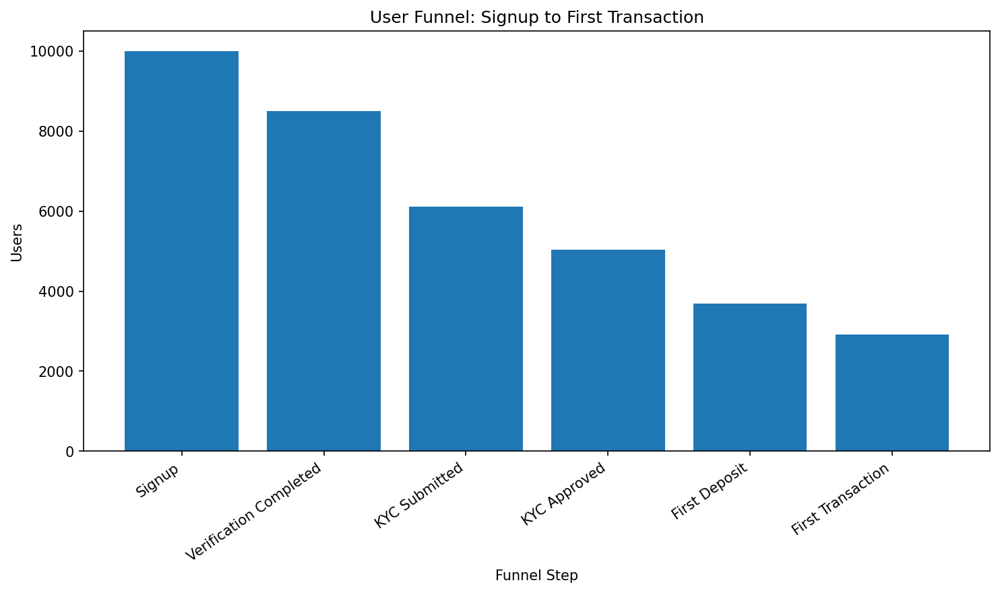
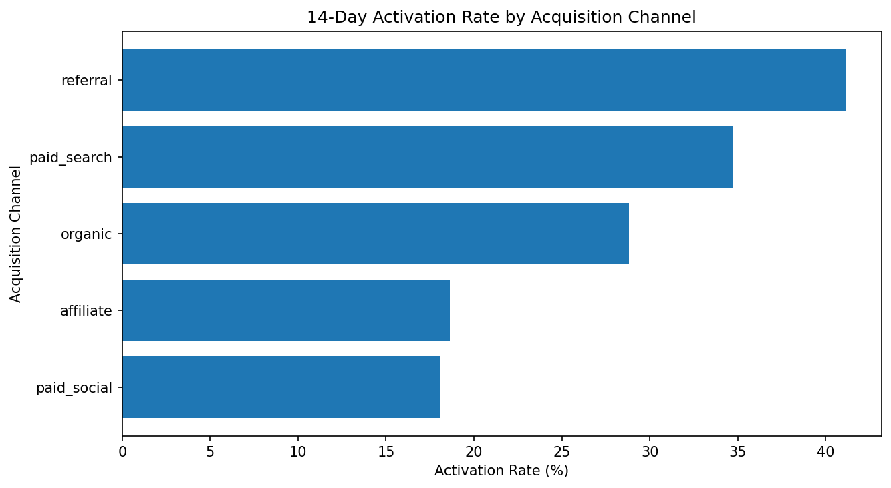
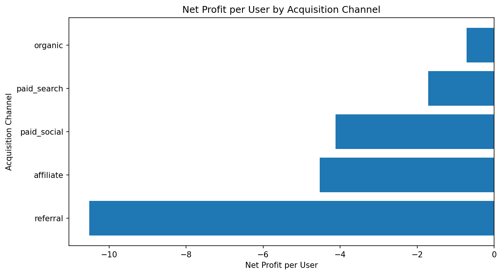
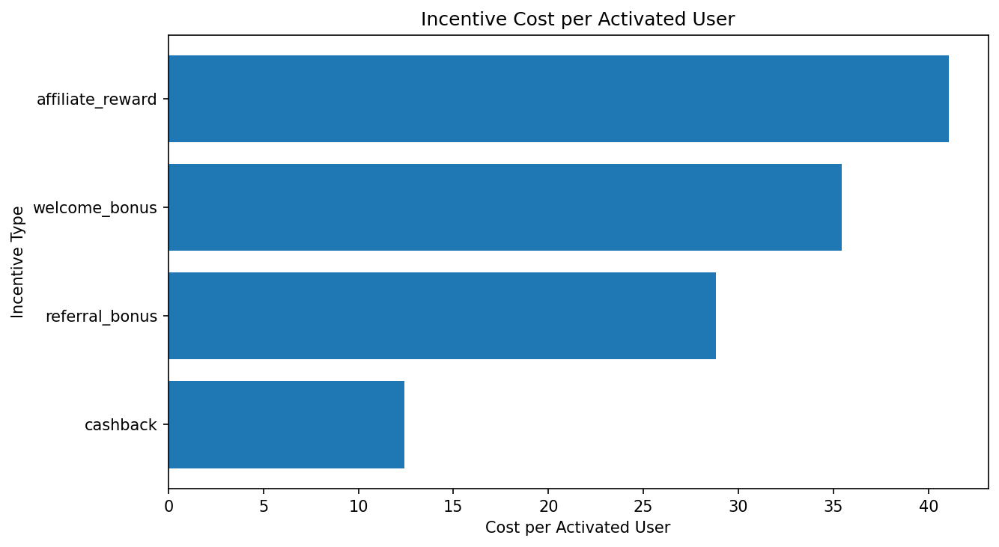
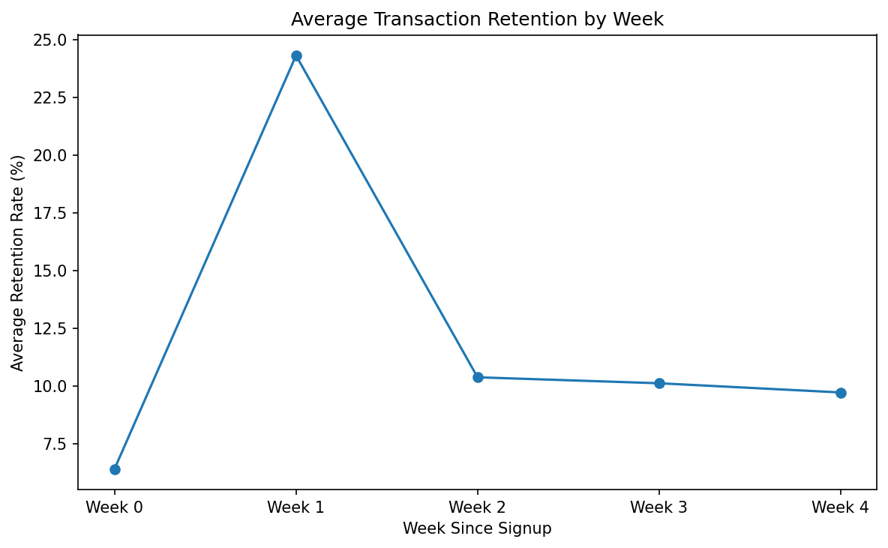

# Fintech Product Funnel & Activation Analysis

A product analytics project analyzing a synthetic fintech app dataset to understand onboarding drop-off, KYC completion, first deposit conversion, first transaction conversion, 14-day activation, acquisition channel quality, incentive profitability, and cohort retention.

This project was built to demonstrate SQL, Python, product analytics, business judgement, and clear analytical communication.

---

## Project Objective

The goal of this project is to answer a practical fintech growth question:

> Where does the user journey break down, which acquisition channels bring valuable users, and are incentives creating profitable activation?

A synthetic dataset was generated to represent a consumer fintech app where users move through the following journey:

```text
Signup → Verification → KYC Submission → KYC Approval → First Deposit → First Transaction
```

A user is defined as **activated** if they complete a first transaction within 14 days of signup.

---

## Key Findings

### 1. The product has a major onboarding leak before KYC submission

Out of 10,000 signed-up users, only 6,108 submitted KYC and 5,041 were approved.

The largest funnel drop-off occurred between verification completion and KYC submission:

```text
Verification Completed: 8,509 users
KYC Submitted:          6,108 users
Drop-off:               2,401 users
Drop-off rate:          28.22%
```

This suggests that identity verification is the biggest early friction point in the product journey.



---

### 2. Only 29.2% of signed-up users reach first transaction

The product converts:

```text
10,000 signed-up users → 2,920 first-transaction users
```

That gives a signup-to-first-transaction conversion rate of:

```text
29.2%
```

This is the clearest end-to-end product conversion metric in the analysis.

---

### 3. Referral and paid search users activate best

Referral users had the highest 14-day activation rate:

```text
Referral activation rate:    41.12%
Paid search activation rate: 34.75%
Organic activation rate:     28.82%
Affiliate activation rate:   18.64%
Paid social activation rate: 18.10%
```

Referral users activated 23.02 percentage points higher than paid social users.



---

### 4. Activation quality and profitability tell different stories

Referral users activate strongly, but referral bonuses are expensive.

The acquisition channel analysis showed that all channels were net negative under the simplified 30-day revenue assumptions, but some channels were much less negative than others.

Organic had the least negative net profit per user, while referral had the worst short-term profitability because of high bonus cost.



---

### 5. Incentives improve activation but are inefficient under current assumptions

Incentivized users activated at a higher rate than non-incentivized users:

```text
Incentivized activation rate:     32.89%
Non-incentivized activation rate: 25.14%
Activation gap:                   7.75 percentage points
```

However, incentives were not profitable on estimated 30-day revenue.

Across all incentives:

```text
Total incentive cost:       41,280.00
Estimated 30-day revenue:    3,637.41
Net profit:                -37,642.59
Revenue-to-cost ratio:           0.088
```

Cashback was the most efficient incentive type by cost per activated user.



---

### 6. Retention weakens after early transaction activity

Average retention peaks around week 1, reflecting the delay between signup, KYC, deposit, and first transaction in the synthetic product journey.

After week 1, retention falls and stabilizes at a lower level, suggesting that the product needs stronger lifecycle engagement after first transaction.



---

## Recommendations

Based on the analysis, the main recommendations are:

1. **Reduce KYC submission friction**  
   The largest funnel leak occurs before KYC submission. The product team should test clearer KYC prompts, document upload guidance, progress indicators, and reminder flows.

2. **Improve first deposit conversion after KYC approval**  
   Many approved users still do not make a first deposit. The team should test clearer funding calls-to-action, more local payment methods, and trust-building messages around deposit safety.

3. **Reduce or retarget weak paid social acquisition**  
   Paid social brings volume but has weak activation and poor profitability. It should be narrowed to higher-intent audiences or reduced until targeting improves.

4. **Scale referral carefully**  
   Referral users activate strongly, but referral bonuses are expensive. Referral should be optimized around payback and not only activation volume.

5. **Prioritize cashback-style incentive experiments**  
   Cashback has strong activation efficiency and a lower cost per activated user than referral bonuses. It is a better candidate for controlled incentive testing.

6. **Build lifecycle campaigns after first transaction**  
   Retention weakens after early activity. The product should test repeat-use prompts, transaction reminders, feature education, and personalized reactivation campaigns.

---

## Dataset

The dataset is synthetic and contains three raw CSV files:

### `users.csv`

One row per user.

Includes:

- signup date
- country
- age band
- acquisition channel
- device type
- risk score
- KYC requirement flag
- referral flag
- incentive flag

### `events.csv`

One row per product event.

Includes:

- signup
- verification completed
- KYC submitted
- KYC approved
- first deposit
- first transaction
- repeat transaction

### `incentives.csv`

One row per incentivized user.

Includes:

- incentive type
- incentive cost
- estimated 30-day revenue

---

## Metrics Defined

### Funnel Conversion

Each funnel step is calculated as the number of users who completed that event.

```text
conversion from previous step = users at current step / users at previous step
```

### 14-Day Activation

A user is activated if:

```text
first transaction date <= signup date + 14 days
```

### Channel Quality

Channels are compared using:

- signup volume
- deposit rate
- transaction rate
- 14-day activation rate
- transaction volume
- estimated 30-day revenue
- incentive cost
- net profit
- net profit per user

### Incentive Profitability

```text
net profit = estimated 30-day revenue - incentive cost
```

The analysis also calculates:

```text
revenue-to-cost ratio = estimated revenue / incentive cost
```

and:

```text
incentive cost per activated user = total incentive cost / activated users
```

### Cohort Retention

Users are grouped by signup week.

Retention weeks are measured relative to each user’s own signup date:

```text
Week 0: days 0–6 after signup
Week 1: days 7–13 after signup
Week 2: days 14–20 after signup
Week 3: days 21–27 after signup
Week 4: days 28–34 after signup
```

---

## Tools Used

- Python
- pandas
- numpy
- matplotlib
- SQLite
- SQL
- Jupyter Notebook

---

## How to Reproduce the Project

### 1. Clone the repository

```bash
git clone https://github.com/Vi-obb/fintech-funnel-analysis.git
cd fintech-funnel-analysis
```

### 2. Create and activate a virtual environment

```bash
python3 -m venv .venv
source .venv/bin/activate
```

### 3. Install dependencies

```bash
python -m pip install --upgrade pip
python -m pip install -r requirements.txt
```

### 4. Generate the synthetic data

```bash
python src/generate_synthetic_data.py
```

### 5. Create the SQLite database

```bash
python src/load_to_sqlite.py
```

### 6. Run SQL analyses

```bash
sqlite3 data/processed/fintech_funnel.db <<'SQL'
.headers on
.mode csv
.output data/processed/funnel_analysis.csv
.read sql/02_funnel_analysis.sql
.output stdout
SQL
```

Repeat similarly for the other SQL files, or inspect each query directly.

### 7. Open the notebook

```bash
jupyter notebook notebooks/fintech_funnel_analysis.ipynb
```

---

## Limitations

This project uses synthetic data. The findings should be interpreted as a demonstration of analytical workflow rather than evidence about a real fintech company.

Key limitations:

1. The data-generating process was manually designed.
2. Estimated revenue is simplified.
3. Acquisition cost is not modelled separately from incentive cost.
4. Retention only uses transaction events.
5. Incentive analysis is descriptive, not causal.
6. No fraud loss, servicing cost, interchange economics, FX spread, subscription revenue, chargebacks, or cost of capital are included.

---

## Future Improvements

Possible extensions:

1. A logistic regression model to predict 14-day activation.
2. Acquisition cost assumptions by channel.
3. Payback period and customer lifetime value estimates.
4. A/B testing logic for incentive experiments.
5. A dashboard or interactive report.
